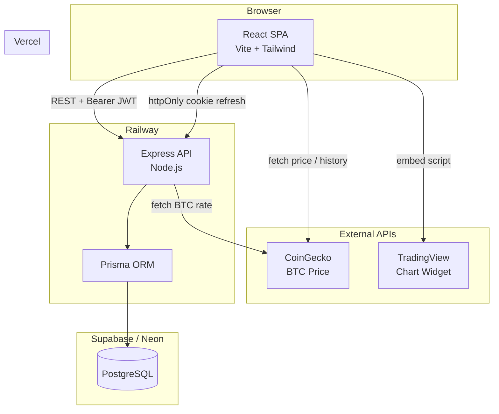
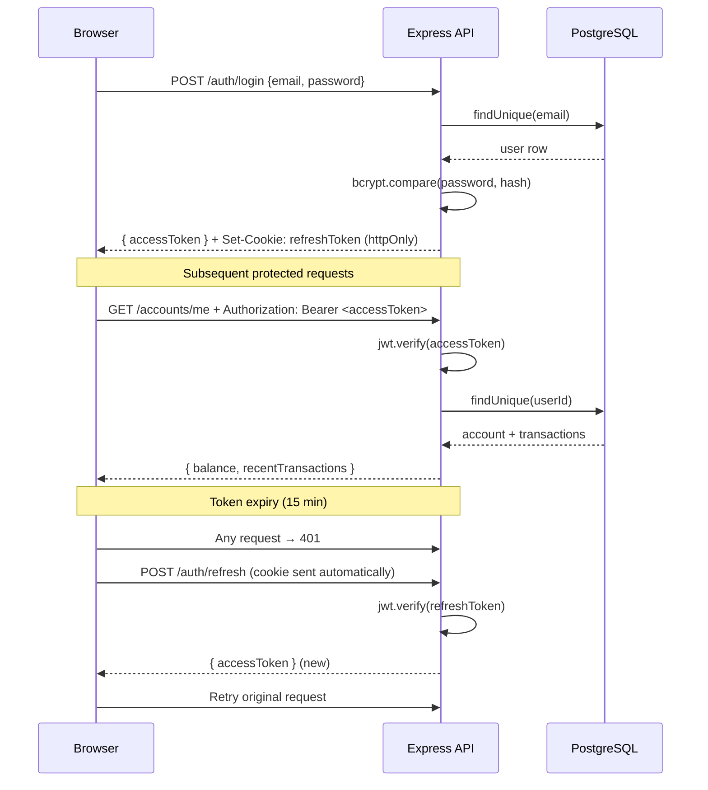
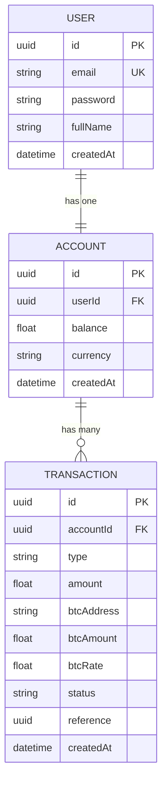

# CredBridge — Architecture & ERD

## System Architecture

```mermaid
graph TD
  subgraph Browser
    A[React SPA<br/>Vite + Tailwind]
  end

  subgraph Vercel
    A
  end

  subgraph Railway
    B[Express API<br/>Node.js]
    C[Prisma ORM]
  end

  subgraph Supabase / Neon
    D[(PostgreSQL)]
  end

  subgraph External APIs
    E[CoinGecko<br/>BTC Price]
    F[TradingView<br/>Chart Widget]
  end

  A -->|REST + Bearer JWT| B
  A -->|httpOnly cookie refresh| B
  B --> C --> D
  A -->|fetch price / history| E
  A -->|embed script| F
  B -->|fetch BTC rate| E
```

---

## Request / Auth Flow

```mermaid
sequenceDiagram
  participant U as Browser
  participant A as Express API
  participant DB as PostgreSQL

  U->>A: POST /auth/login {email, password}
  A->>DB: findUnique(email)
  DB-->>A: user row
  A->>A: bcrypt.compare(password, hash)
  A-->>U: { accessToken } + Set-Cookie: refreshToken (httpOnly)

  Note over U,A: Subsequent protected requests

  U->>A: GET /accounts/me + Authorization: Bearer <accessToken>
  A->>A: jwt.verify(accessToken)
  A->>DB: findUnique(userId)
  DB-->>A: account + transactions
  A-->>U: { balance, recentTransactions }

  Note over U,A: Token expiry (15 min)

  U->>A: Any request → 401
  U->>A: POST /auth/refresh (cookie sent automatically)
  A->>A: jwt.verify(refreshToken)
  A-->>U: { accessToken } (new)
  U->>A: Retry original request
```

---

## Entity Relationship Diagram

```mermaid
erDiagram
  USER {
    uuid   id         PK
    string email      UK
    string password
    string fullName
    datetime createdAt
  }

  ACCOUNT {
    uuid   id         PK
    uuid   userId     FK
    float  balance
    string currency
    datetime createdAt
  }

  TRANSACTION {
    uuid   id         PK
    uuid   accountId  FK
    string type
    float  amount
    string btcAddress
    float  btcAmount
    float  btcRate
    string status
    uuid   reference
    datetime createdAt
  }

  USER ||--|| ACCOUNT : "has one"
  ACCOUNT ||--o{ TRANSACTION : "has many"
```
